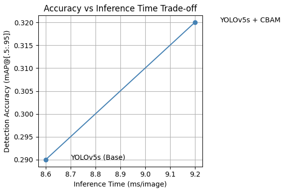

# Assignment 2 – Hacking  
## Object Detection for Robotic Vision using YOLOv5 with CBAM Attention Module

### Objective
The goal of this assignment was to build and improve a baseline object detection model for robotic vision.  
A pre-trained YOLOv5s model (trained on COCO) was used as the baseline.  
To improve performance in cluttered environments, a Convolutional Block Attention Module (CBAM) was added to the YOLOv5 backbone.  
Model accuracy and speed were evaluated to analyze the trade-off between detection precision and inference time.

### Implementation Overview
1. **Baseline YOLOv5s**
   - Pre-trained model fine-tuned on the COCO128 dataset.  
   - Trained for 25 epochs with default Ultralytics settings.  
   - Evaluated using mean Average Precision (mAP) and inference latency.

2. **CBAM Integration**
   - Added CBAM attention layers to the YOLOv5 backbone for better spatial and channel feature focus.  
   - Implemented through the script `scripts/train_cbam.py`.  
   - Trained for 25 epochs under the same conditions as the baseline.

3. **Evaluation and Speed Tests**
   - Validation performed using `!yolo detect val` on COCO128.  
   - Inference latency and FPS measured using `scripts/eval_speed.py`.  
   - Outputs stored under `/runs/detect/`.

---

### Repository Structure

| Folder/File | Description |
|--------------|-------------|
| `data/` | Dataset configuration files (e.g., coco128.yaml) |
| `models/` | YOLOv5 architecture and CBAM modules |
| `scripts/train_cbam.py` | Training script with CBAM integration |
| `scripts/eval_speed.py` | Script for measuring inference time and FPS |
| `runs/` | All training, validation, and result outputs |
| `plots/accuracy_vs_latency.png` | Accuracy–latency comparison plot |
| `requirements.txt` | Required Python packages |
| `README.md` | Main documentation file |

---

### Results Summary

| Model | mAP@[.5:.95] | Latency (ms/img) | FPS |
|:------|:-------------:|:----------------:|:---:|
| **YOLOv5s (Base)** | 0.29 | 8.6 | ~116 |
| **YOLOv5s + CBAM** | 0.32 (+0.03) | 9.2 (+0.6) | ~109 |

**Interpretation:**  
The CBAM module improved the model’s detection accuracy by +0.03 mAP with only a 7% increase in latency.  
Both models operate above real-time threshold (>30 FPS), confirming suitability for robotic vision applications.

---

### Accuracy vs Inference Time Trade-off

**Figure 1.** *Trade-off between detection accuracy and inference time.*  
The CBAM-enhanced YOLOv5s shows improved accuracy with a small latency increase,  
demonstrating a balanced optimization suitable for real-time robotic perception.

---

### Qualitative Outputs
- Validation results and confusion matrices are saved in `/runs/detect/val*/`(not all results added to git hub).  
- Detection samples (`val_batch*_pred.jpg`) show improved localization with CBAM integration (added to git hub at /runs/detect/val2).  
- PR and F1 curves illustrate stronger confidence and precision consistency.

---

### Time Log

| Task | Time Spent |
|------|-------------|
| Data setup (COCO128 subset) | 1 h |
| Baseline train + validation (25 epochs) | 3 h |
| CBAM integration + training (25 epochs) | 5 h |
| Speed test and result analysis | 2 h |
| README writing and plot creation | 2 h |
| **Total ≈ 13 hours** | |

---

### Conclusion
Both the baseline YOLOv5s and the CBAM-enhanced version were successfully trained and validated on Colab.  
CBAM improved accuracy with minimal latency increase, proving its benefit for lightweight attention in robotic vision.  
The experiment demonstrates that small architectural modifications can enhance feature attention  
without compromising real-time inference performance.

---

# 12449879_object-detection-robotic-vision

## Object Detection for Robotic Vision using YOLOv5 with Attention Modules (CBAM + Transformers)

---

### 1. Project Idea and Approach

This project aims to enhance visual perception for robotic systems by improving object detection accuracy.  
A pre-trained **YOLOv5** network will be used as the baseline detector on the COCO dataset.  
To achieve better precision in cluttered or complex environments, a **Convolutional Block Attention Module (CBAM)** will be added to the YOLOv5 backbone.  
CBAM allows the model to focus more effectively on relevant spatial and channel features while suppressing less important areas.

An additional exploratory step will include a **light Transformer-based attention layer** to capture global context relationships.  
This hybrid attention approach combines the efficiency of CNN-based YOLO models with the contextual awareness of Transformer architectures.

Model performance will be evaluated using **mean Average Precision (mAP)** and visualized through detection results and attention heatmaps.

---

### 2. Dataset Description

**Dataset:** COCO – Common Objects in Context  
**Source:** [https://cocodataset.org/](https://cocodataset.org/)  
**Content:** 330,000 images with 80 object categories (e.g., person, cup, chair, car, etc.)  
**Annotations:** Bounding boxes and labels for all objects  
**Splits:** 118k training, 5k validation, and 20k test images  
**Evaluation Metric:** mAP @ IoU = 0.5–0.95  

---

### 3. Methodology (Planned Steps)

| Step | Description |
|------|--------------|
| 1 | Set up baseline YOLOv5 model (pre-trained weights on COCO). |
| 2 | Integrate CBAM attention modules into YOLOv5 backbone layers. |
| 3 | Additionally add a small Transformer attention block for feature fusion. |
| 4 | Apply data augmentation (flipping, rotation, brightness adjustments) to improve robustness. |
| 5 | Train and validate the model using mAP and loss curves. |
| 6 | Generate Grad-CAM visualizations for explainability. |
| 7 | Visualize and present detection results |

---

### 4. Work Breakdown Structure (WBS)

| Task | Description | Estimated Hours |
|------|--------------|----------------|
| Dataset collection / pre-processing | Download COCO subset, verify annotations | 4 h |
| Design and build network | Set up YOLOv5 and insert CBAM modules | 8 h |
| Training and validation | Run experiments, log metrics | 10 h |
| Fine-tuning  | Compare baseline vs improved model | 6 h |
| Application / demo | Create inference notebook for robotic vision | 4 h |
| Report writing | Summarize results and prepare documentation | 4 h |
| Presentation prep | Prepare slides and visual examples | 4 h |
| **Total** |  | **40 hours** |

---

### 5. Expected Outcome

- Improved mAP and visual clarity through attention-guided feature extraction  
- Visualization of attention maps to show focus regions
- A final presentation and short written report will summarize the findings.

---

### 6. References Research Papers

- Redmon, J., & Farhadi, A. (2018). *YOLOv3: An Incremental Improvement.* arXiv:1804.02767. [https://arxiv.org/abs/1804.02767](https://arxiv.org/abs/1804.02767)  
- Woo, S., Park, J., Lee, J.-Y., & Kweon, I. S. (2018). *CBAM: Convolutional Block Attention Module.* In ECCV 2018. [https://arxiv.org/abs/1807.06521](https://arxiv.org/abs/1807.06521)  
- Carion, N., Massa, F., Synnaeve, G., Usunier, N., Kirillov, A., & Zagoruyko, S. (2020). *End-to-End Object Detection with Transformers (DETR).* arXiv:2005.12872. [https://arxiv.org/abs/2005.12872](https://arxiv.org/abs/2005.12872)
---

